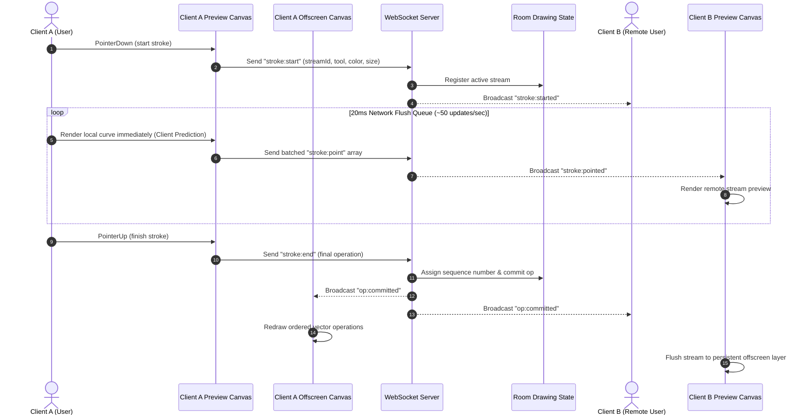

# 🏗️ Technical Architecture & System Design

This document details the architectural decisions, distributed state synchronization strategies, WebSocket wire protocol, performance optimizations, and scaling considerations for the **Real-Time Collaborative Drawing Canvas**.

---

## 🌐 Live Production Demo & Video Walkthrough
- **Deployed Application**: [https://realtime-collaborative-canvas-f51da8d7c6ed.herokuapp.com/](https://realtime-collaborative-canvas-f51da8d7c6ed.herokuapp.com/)
- **Video Demo Folder (Google Drive)**: [https://drive.google.com/drive/folders/1NLAx4XU6Cij5w9YYtnPhIfm4fSrnI7Vc?usp=sharing](https://drive.google.com/drive/folders/1NLAx4XU6Cij5w9YYtnPhIfm4fSrnI7Vc?usp=sharing)
- **Target Platform**: Node.js Container (Heroku / Render / Railway)

---

## 1. System Overview & Distributed State Model

The application operates as a **server-authoritative distributed operation log system**. The HTML5 Canvas is treated purely as a **rendering surface**, while the **vector operation log** represents the application's actual source of truth.

```text
                                  ┌────────────────────────────┐
                                  │       Node.js Server       │
                                  │                            │
                                  │   WebSocket Gateway        │
                                  │             │              │
                                  │             ▼              │
                                  │       Room Manager         │
                                  │             │              │
                                  │             ▼              │
                                  │      DrawingState          │
                                  │                            │
                                  │  operations[]              │
                                  │  undoStack[]               │
                                  │  redoStack[]               │
                                  │  nextSequenceCounter       │
                                  └─────────────┬──────────────┘
                                                │
                                         WebSocket Protocol
                                                │
            ┌───────────────────────────────────┼───────────────────────────────────┐
            │                                   │                                   │
            ▼                                   ▼                                   ▼
      ┌──────────┐                        ┌──────────┐                        ┌──────────┐
      │ Client A │                        │ Client B │                        │ Client C │
      │          │                        │          │                        │          │
      │ Canvas   │                        │ Canvas   │                        │ Canvas   │
      │ Engine   │                        │ Engine   │                        │ Engine   │
      │ UI       │                        │ UI       │                        │ UI       │
      └──────────┘                        └──────────┘                        └──────────┘
```

### Core Architectural Principle
> **Don't transmit canvas images or screenshots. Transmit immutable vector operations.**
> **The canvas is a transient rendering surface; the ordered operation log is the true state.**

---

## 2. Operation Log Data Model

Every drawing action committed to a room is represented as a structured operation object:

```json
{
  "id": "op_1726210005_c3d4",
  "sequence": 42,
  "userId": "user_1726210000_x9z",
  "userName": "Swift Fox",
  "userColor": "#FF5722",
  "tool": "brush",
  "color": "#3B82F6",
  "size": 5,
  "points": [
    { "x": 100, "y": 200 },
    { "x": 105, "y": 204 },
    { "x": 112, "y": 208 }
  ],
  "startPoint": { "x": 100, "y": 200 },
  "endPoint": { "x": 112, "y": 208 },
  "timestamp": 1726210005123,
  "undone": false
}
```

---

## 3. Data Flow & Streaming Lifecycle



---

## 4. Layered Canvas Rendering Strategy

To achieve a consistent **60 FPS** under high activity, rendering is partitioned into 3 stacked HTML5 Canvas layers:

```text
+-------------------------------------------------------+
|  Cursor Canvas Layer (Z-Index: 30)                    |
|  - Remote mouse positions, user tags, active ripples  |
+-------------------------------------------------------+
|  Preview Canvas Layer (Z-Index: 20)                   |
|  - Local live stroke & remote in-progress streams     |
+-------------------------------------------------------+
|  Offscreen Main Canvas Layer (Z-Index: 10)            |
|  - Persistent finalized vector operations history     |
+-------------------------------------------------------+
```

---

## 5. Global Undo/Redo & Conflict Resolution Strategy

### 1. Global LIFO Active Operation Undo
In a multi-user environment:
- **Operation History**: The server maintains a sequence-ordered operation log.
- **Undo Execution**: When a user clicks Undo, the server locates the most recent active operation (`undone === false`) in the room's sequence log, sets `op.undone = true`, and broadcasts the updated state snapshot.
- **Branching History**: If a new operation is drawn after an undo, the server clears the room's `redoStack`, enforcing clean history branching.

### 2. Server-Authoritative Monotonic Sequence Numbers
Clients do **not** determine operation order using local client timestamps (which suffer from clock skew).
- **Sequence Assignment**: The server assigns a monotonically increasing `sequence` integer (`1, 2, 3...`) as operations arrive.
- **Deterministic Convergence**: Every client renders operations in exact sequence order. If User A (Red) and User B (Blue) draw over the same area simultaneously, the server sequence determines rendering order. Later operations cleanly overlay earlier ones on all browsers identically.

### 3. Why CRDT / OT Was Intentionally Avoided
> **Architectural Justification**: CRDT (Conflict-free Replicated Data Types) or OT (Operational Transformation) are necessary for offline peer-to-peer text editing with complex text cursor insertions. For a real-time append-only vector canvas where the central server establishes strict operation ordering, an **authoritative append-only operation log with deterministic replay** provides identical consistency guarantees with far lower complexity and zero client overhead.

---

## 6. Performance Optimization & Event Batching

1. **Event Batching vs. Raw Throttling**:
   - High-refresh displays generate up to 240 `pointermove` events/sec.
   - Sending every raw event floods WebSockets.
   - We accumulate raw mouse movements into a `pendingPointBatch` queue and flush them every **20ms** (~50 network updates/sec).
2. **Path Smoothing via Midpoint Bezier Interpolation**:
   - Converts discrete points into smooth curves via `quadraticCurveTo(P1.x, P1.y, Mid.x, Mid.y)`.
3. **High-DPI (Device Pixel Ratio) Canvas Scaling**:
   - Automatically multiplies canvas dimensions by `window.devicePixelRatio` for Retina sharpness without visual distortion.

---

## 7. Network Failure & Reconnection Recovery

When a client loses network connectivity:
1. The client's WebSocket manager attempts auto-reconnection with exponential backoff.
2. Upon reconnection, the client automatically requests a full room state snapshot from the server (`type: "join"`).
3. The client receives the server-authoritative operation history, clears its canvas, and replays all active sequence operations cleanly.

---

## 8. Scaling to 1,000 Concurrent Users

To scale beyond a single Node.js instance:

```text
                  Load Balancer (Sticky Sessions)
                                │
          ┌─────────────────────┼─────────────────────┐
          ▼                     ▼                     ▼
      WS Node 1             WS Node 2             WS Node 3
          │                     │                     │
          └─────────────────────┼─────────────────────┘
                                ▼
                           Redis Pub/Sub
                                │
                                ▼
                       Persistent Store (MongoDB / Redis)
```

1. **Room Sharding**: Rooms are partitioned across WebSocket worker nodes using room-ID sticky hashing on the load balancer.
2. **Redis Pub/Sub**: Cross-node WebSocket synchronization for users in the same room connected to different worker instances.
3. **Snapshot Caching**: Periodically flattening operation history into image snapshots after every 1,000 operations to accelerate late-joiner replay.
